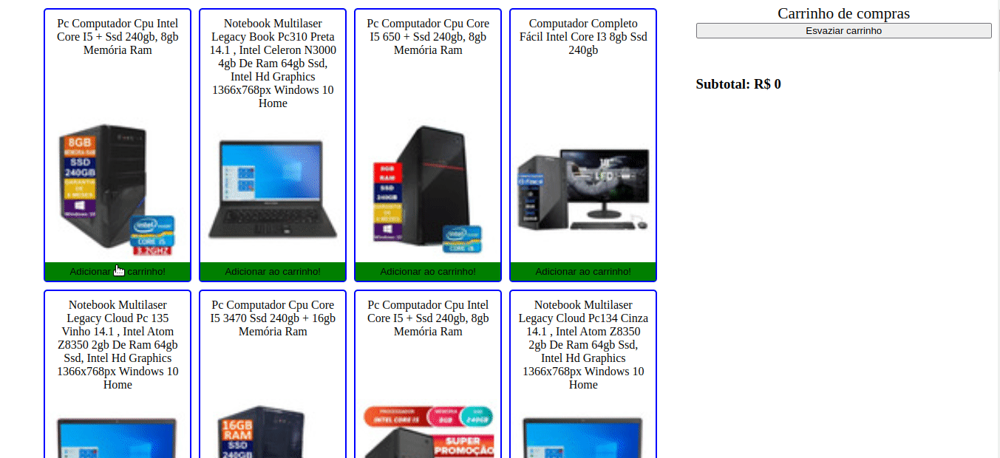

# About the project / *Sobre o projeto*

This project is a shopping cart with requests made through a Mercado Livre API.

*Esse projeto é um carrinho de compras com requisições realizadas através de uma API do Mercado Livre.*

---
# Skills / *Habilidades*

 - API requests / *Requisições API*
 - HTML, CSS, Javascript
 - Asynchronous functions / *Funções assíncronas*

---
# Layout

---
# Deployment / *Implantação*

See it in action/ **Veja em ação**: [https://kelsonbatista.github.io/project-shopping-cart/](https://kelsonbatista.github.io/project-shopping-cart/)
